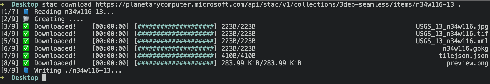

# stac-cli

Command line interface to [stac-rs](https://github.com/gadomski/stac-rs).

## Features

Download all the assets of a STAC item:



The STAC item will be written out, with its asset links updated to point to the locally downloaded assets.

## Installation

Install rust.
[rustup](https://rustup.rs/) works well.
Once you do:

```sh
cargo install stac-cli
```
