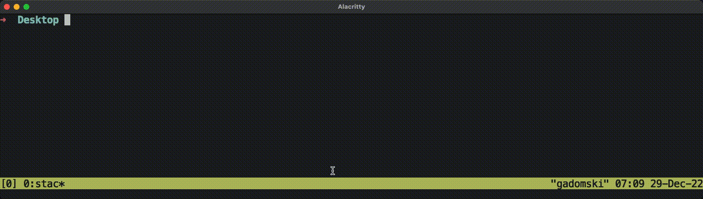

# stac-cli

Command line interface to [stac-rs](https://github.com/gadomski/stac-rs).

## Installation

Install rust.
[rustup](https://rustup.rs/) works well.
Once you do:

```sh
cargo install --git https://github.com/gadomski/stac-incubator-rs
```

## Features

Use the cli `--help` flag to see all available options:

```shell
stac --help
```

### Download

Download all the assets of a STAC item.
The STAC item will be written out, with its assets updated to point to the locally downloaded assets.

### Validate

Validate a STAC object with [json-schema](https://json-schema.org/):


